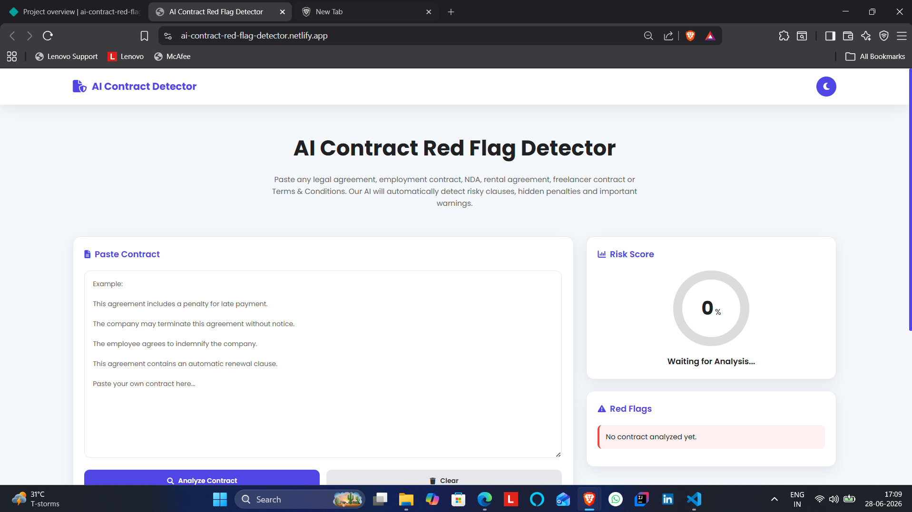
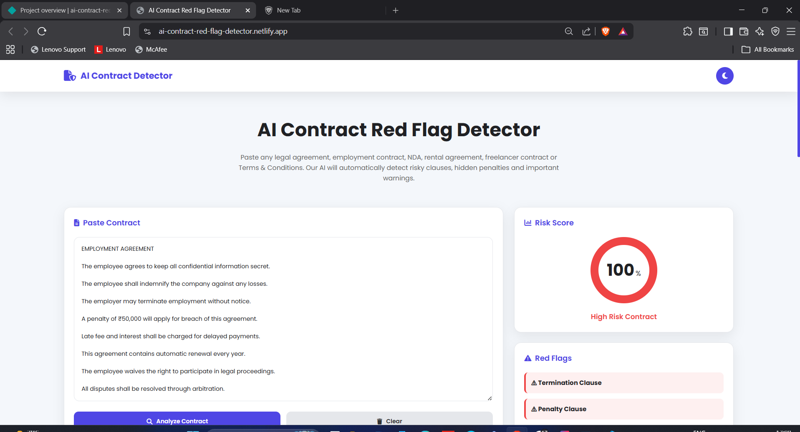
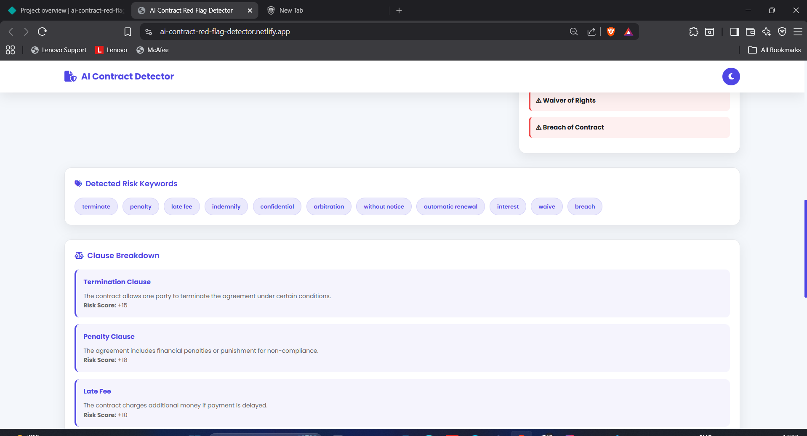

# AI Contract Red Flag Detector

## 🚀 Day 20 of my 30 Days 30 AI Websites Challenge

AI Contract Red Flag Detector is an AI-inspired web application designed to help users quickly identify potentially risky clauses hidden inside contracts before signing them.

Many people sign internship offers, employment agreements, freelance contracts, rental agreements, service contracts, or Terms & Conditions without fully understanding the legal implications. This project aims to simplify contract review by highlighting commonly found red flags and providing a structured risk assessment.

Instead of manually reading long legal documents, users can paste contract text into the application and instantly receive a professional report containing detected issues, contract risk level, recommendations, and an overall risk score.

---

## 🌐 Live Demo

https://ai-contract-red-flag-detector.netlify.app/

---

## 📸 Screenshots

---

## ✨ Features

* AI-inspired Contract Analysis
* Smart Contract Risk Score
* Hidden Clause Detection
* Non-Compete Clause Detection
* Notice Period Analysis
* Automatic Renewal Detection
* One-sided Cancellation Warning
* Penalty Clause Identification
* Ambiguous Language Detection
* Privacy & Data Usage Review
* AI Risk Recommendations
* Professional Contract Report
* Copy Report Feature
* Download Report Feature
* Fully Responsive Modern UI

---

## 📋 How It Works

1. Paste your contract or agreement.
2. Start the contract analysis.
3. Detect potential legal red flags.
4. View the overall contract risk score.
5. Review highlighted risky clauses.
6. Read AI-inspired recommendations.
7. Copy or download the generated report.

---

## 📄 Supported Documents

* Employment Contracts
* Internship Offer Letters
* Freelance Agreements
* Rental Agreements
* Vendor Contracts
* Service Agreements
* Client Contracts
* Terms & Conditions
* General Legal Documents

---

## 🛠️ Technologies Used

* HTML
* CSS
* JavaScript
* Built with the help of AI-assisted development tools

---

## 🎯 Challenge Progress

✅ Day 20 Completed — AI Contract Red Flag Detector

Part of my **30 Days 30 AI Websites Challenge**, where I build and publish one AI-inspired web application every day to improve my frontend development, software engineering, UI/UX design, product thinking, and problem-solving skills.

---

## 🚀 Future Improvements

* PDF Contract Upload
* DOCX File Support
* OCR for Scanned Contracts
* Clause-by-Clause Explanation
* AI Legal Assistant
* Multi-language Support
* Contract Comparison
* Saved Analysis History
* Cloud Storage Integration

---

## 👨‍💻 Author

**Bettam Anand**

B.Tech CSE (Data Science)

JNTUH University College of Engineering Palair
